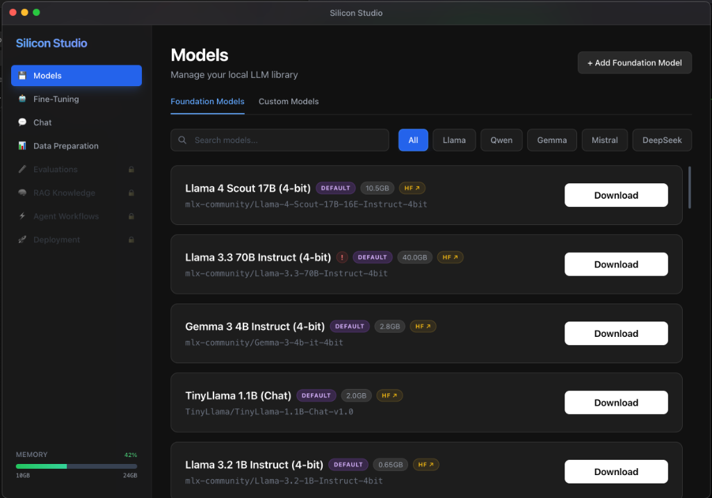
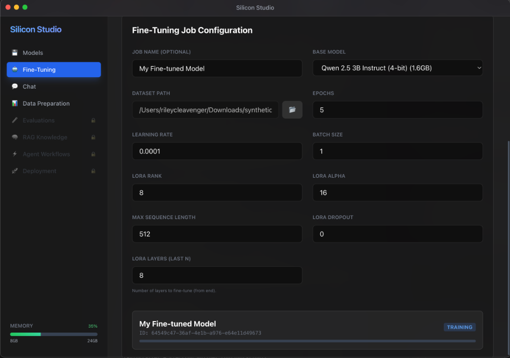
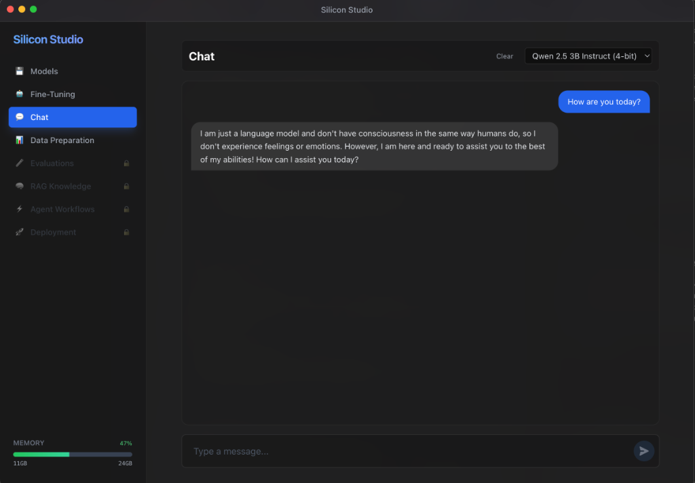

# Silicon Studio

<div align="center">



**The All-in-One Local AI Workbench for Apple Silicon**

[](https://opensource.org/licenses/MIT)
-black)


</div>

---

**Silicon Studio** is a powerful, open-source desktop application designed to make local LLM fine-tuning and inference accessible to everyone on Apple Silicon Macs. Built on top of Apple's [MLX](https://github.com/ml-explore/mlx) framework, it provides a unified interface for data preparation, model management, fine-tuning, and evaluation.

## ✨ Features

### 🍎 Native Apple Silicon Performance
Leverage the full power of your M1/M2/M3/M4 chips. Silicon Studio uses the MLX framework for efficient, hardware-accelerated fine-tuning (LoRA/QLoRA) and inference directly on your Mac.

### 📊 Data Preparation Studio
A built-in studio to clean, format, and prepare your training datasets.
- **Preview & Edit**: Visualize JSONL and CSV datasets instantly.
- **Privacy Shield**: Automatically strip PII (Personally Identifiable Information) from your datasets using local NLP models.
- **Format Conversion**: Convert between common formats (CSV -> JSONL) compatible with Llama, Mistral, and other chat templates.

### 🤖 Model Management
Browse, download, and manage open-source models directly from Hugging Face.
- **One-Click Downloads**: Supports popular architectures like Llama 3, Mistral, Qwen 2.5, Gemma, and Phi.
- **Quantization Support**: Run large models efficiently with 4-bit and 8-bit quantization.

### 🦾 Fine-Tuning Engine
Fine-tune models on your own data without a cloud GPU.
- **LoRA / QLoRA**: Efficient low-rank adaptation for fine-tuning large models with minimal VRAM.
- **Visual Configuration**: Configure learning rates, epochs, rank, and more with a simple UI.
- **Real-time Monitoring**: Watch loss curves and training metrics in real-time.



### 💬 Local Chat Inference
Test your fine-tuned models immediately in a ChatGPT-like interface.
- **Private & Offline**: Your data never leaves your device.
- **Instant Switching**: Toggle between base models and your fine-tuned adapters.



## 🚀 Getting Started

### Installation

**Option 1: Download Release (Recommended)**
Download the latest `.dmg` from the [Releases]([https://github.com/yourusername/silicon-studio/releases](https://github.com/rileycleavenger/Silicon-Studio/releases/tag/0.1.0)) page.

**Option 2: Build from Source**

Prerequisites:
- macOS 13+ (Ventura or later)
- Apple Silicon Mac
- Node.js 18+
- Python 3.10+ (Anaconda recommended)

```bash
# Clone the repository
git clone [https://github.com/yourusername/silicon-studio.git](https://github.com/rileycleavenger/Silicon-Studio.git)
cd silicon-studio

# Install dependencies
npm install

# Setup Backend Environment
cd backend
# Create a conda env (recommended) or venv
conda create -n silicon-studio python=3.11
conda activate silicon-studio
pip install -r requirements.txt
cd ..

# Run Development Mode
npm run dev
```

## 🛠️ Tech Stack

- **Frontend**: Electron, React, TypeScript, Vite, TailwindCSS
- **Backend**: Python, FastAPI
- **AI Engine**: Apple MLX, MLX-LM
- **Data Processing**: Pandas, Presidio (Microsoft), Spacy

## 🤝 Contributing

Contributions are welcome! We want to make local AI accessible to everyone. Refactoring, documentation, and new features are all appreciated.

1. Fork the Project
2. Create your Feature Branch (`git checkout -b feature/AmazingFeature`)
3. Commit your Changes (`git commit -m 'Add some AmazingFeature'`)
4. Push to the Branch (`git push origin feature/AmazingFeature`)
5. Open a Pull Request

## 📄 License

Distributed under the MIT License. See `LICENSE` for more information.

---

<div align="center">
Built with ❤️ for the Local AI Community
</div>
