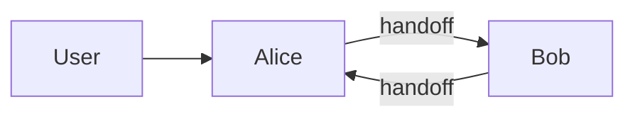
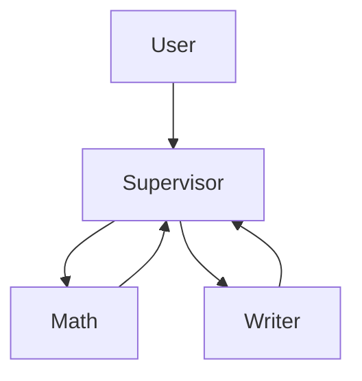

# 🤖 LangGraph Agent Starter Kit (TypeScript)

**Your first agent team in 5 minutes.**
Production-minded scaffolding for building multi-agent systems with LangGraph.

- ✅ **Two patterns**: Swarm (peer specialists) & Supervisor (central orchestrator)
- ✅ **Memory**: short-term (threaded) + long-term (store)
- ✅ **HTTP service**: Fastify endpoints for easy integration
- ✅ **Strict TS**: clean abstractions, fewer runtime surprises
- ✅ **Drop-in tools & agents**: add business logic without re-wiring the graph

---

## Table of Contents

- [Quick Start](#quick-start)
- [Requirements](#requirements)
- [Project Structure](#project-structure)
- [Environment Variables](#environment-variables)
- [Run Modes](#run-modes)
- [HTTP API](#http-api)
- [Architecture](#architecture)
- [How to Extend](#how-to-extend)
  - [Add a Tool](#add-a-tool)
  - [Add an Agent](#add-an-agent)
  - [Use Private Message State](#use-private-message-state)
  - [Create a Custom Handoff Tool](#create-a-custom-handoff-tool)
  - [Supervisor Options](#supervisor-options)
- [Memory & Threading](#memory--threading)
- [Troubleshooting](#troubleshooting)
- [Security Notes](#security-notes)

---

## Quick Start

```shell
# 1) Install deps
npm install

# 2) Configure environment
cp .env.example .env
# open .env and set your key:
# OPENAI_API_KEY=sk-...

# 3) CLI demo (prints outputs to console)
npm run dev

# 4) HTTP server (Fastify on http://localhost:3000)
npm run dev:http
```

> If `npm run dev` complains about missing env, ensure `src/index.ts` starts with `import "./env";` (this repo already includes it).

---

## Requirements

- Node.js 18+
- An OpenAI API key (`OPENAI_API_KEY`)
- Internet connectivity for LLM calls

---

## Project Structure

```shell
agent-starter/
  package.json
  tsconfig.json
  .env.example
  README.md
  src/
    env.ts                 # loads .env (dotenv/config)
    llm.ts                 # OpenAI model factory
    tools.ts               # example tools (add, multiply, echo)
    agent-factory.ts       # helper to create agents (optionally with private message keys)
    handoff.ts             # createHandoffTool() for agent handoffs in Swarm
    swarm.ts               # Swarm builder with memory
    supervisor.ts          # Supervisor builder with options
    app-swarm.ts           # wires Alice ↔ Bob swarm
    app-supervisor.ts      # wires Supervisor with Math + Writer agents
    http.ts                # Fastify routes: /swarm and /supervisor
    index.ts               # CLI demo invoking swarm & supervisor
  examples/
    your-first-agent-team.md  # narrative walkthrough for
```

---

## Environment Variables

Place these in `.env`:

```shell
OPENAI_API_KEY=your_openai_key_here
PORT=3000
```

`src/env.ts` uses `dotenv/config` to load them on import.
`src/index.ts` **explicitly imports** `./env` to ensure CLI runs see env vars.

---

## Run Modes

### CLI Demo

Runs a two-turn Swarm conversation and a Supervisor task:

```shell
npm run dev
```

- Swarm: Alice (addition expert) and Bob (pirate who can multiply) can **handoff** via tools.
- Supervisor: Routes math to `math_expert` and writing to `writer`.

### HTTP Server

Exposes two endpoints on `http://localhost:3000`:

```shell
npm run dev:http
```

- `POST /swarm`
- `POST /supervisor`

---

## HTTP API

### Common Request Shape

Body:

```json
{
  "messages": [{ "role": "user", "content": "talk to bob then add 5 and 7" }],
  "thread_id": "t1"
}
```

### Endpoints

#### POST /swarm

```shell
curl -s http://localhost:3000/swarm \
  -H "Content-Type: application/json" \
  -d '{"messages":[{"role":"user","content":"talk to bob then add 5 and 7"}],"thread_id":"demo"}' | jq
```

#### POST /supervisor

```shell
curl -s http://localhost:3000/supervisor \
  -H "Content-Type: application/json" \
  -d '{"messages":[{"role":"user","content":"sum 10 and 15, then write a one-line summary"}],"thread_id":"demo"}' | jq
```

> `thread_id` is important for **short-term memory** (see below).

---

## Architecture

### Swarm (Peer Specialists)

- Multiple agents collaborate and **handoff** using tools.
- Graph **remembers last active agent** to resume the right context.
- Good when peers call each other dynamically.



### Supervisor (Central Orchestrator)

- A **supervisor** selects the right specialized agent each turn.
- Policy-driven routing, context trimming, HITL, validation.



---

## How to Extend

### Add a Tool

Edit `src/tools.ts`:

```ts
import { z } from "zod";
import { tool } from "@langchain/core/tools";

export const fetchProfile = tool(
  async (args) => {
    // Your business logic here
    return { id: args.userId, name: "Alice Example" };
  },
  {
    name: "fetch_profile",
    description: "Fetch a user profile by id",
    schema: z.object({ userId: z.string() }),
  }
);
```

Then include it in one or more agents (e.g., in `app-supervisor.ts`).

### Add an Agent

Use the factory in `src/agent-factory.ts`:

```ts
import { llm } from "./llm";
import { makeAgent } from "./agent-factory";
import { fetchProfile } from "./tools";

const profileAgent = makeAgent({
  name: "profile_expert",
  llm,
  tools: [fetchProfile],
  system: "You are a profile assistant. Always fetch profile via tool.",
});
```

Wire it into Swarm or Supervisor apps.

### Use Private Message State

If an agent shouldn’t expose its full internal history (e.g., for privacy or cleanliness), give it a private messages key:

```ts
const alice = makeAgent({
  name: "alice",
  llm,
  tools: [...],
  system: "You are Alice.",
  privateMessagesKey: "alice_messages"
});
```

The factory handles a `SystemMessage` prepend and routing based on that key.

### Create a Custom Handoff Tool

Default handoff (`src/handoff.ts`) updates parent state and jumps to target agent:

```ts
import { createHandoffTool } from "./handoff";

const alice = makeAgent({
  name: "alice",
  llm,
  tools: [
    createHandoffTool({ agentName: "bob", description: "Transfer to Bob" }),
  ],
  system: "You are Alice.",
});
```

You can clone and modify the tool to pass extra state (e.g., `taskDescription`) in `Command.update`.

### Supervisor Options

`src/supervisor.ts` exposes options you can set in `makeSupervisor`:

- `outputMode`: `"last_message"` or `"full_history"`
- `includeAgentName`: inline agent name to model if provider requires it
- `preModelHook` / `postModelHook`: context trimming, guardrails, HITL
- `responseFormat`: ask the supervisor to produce structured output (requires a model that supports structured output)

Example with last-message output and a simple pre-hook:

```ts
export const supervisorApp = makeSupervisor({
  agents: [math, writer],
  llm,
  outputMode: "last_message",
  preModelHook: (state) => {
    const msgs = state.messages ?? [];
    const trimmed = msgs.slice(-20); // keep last 20
    return { messages: trimmed };
  },
});
```

---

## Memory & Threading

- **Short-term memory**: Enabled via `new MemorySaver()` and `configurable.thread_id`.
  - If you don’t pass `thread_id`, multi-turn conversations won’t persist.
- **Long-term memory**: Set up a `store` (e.g., `InMemoryStore`) in `.compile({ store })` for cross-thread persistence patterns if you add them later.

Where it’s wired:

- Swarm: `makeSwarm()` compiles with a `checkpointer` (and optional `store`)
- Supervisor: `makeSupervisor()` compiles with a `checkpointer` (and optional `store`)

---

## Troubleshooting

### “OPENAI_API_KEY missing”

- Ensure `.env` has `OPENAI_API_KEY=...`

- Ensure `src/index.ts` begins with:

  ```ts
  import "./env";
  ```

- The HTTP server already imports `./env` via `src/env.ts`.

### “System message should be first”

- If you use a dynamic prompt function, **prepend** a `SystemMessage`:

  ```ts
  const prompt = (state: any) => [new SystemMessage("..."), ...state.messages];
  ```

### “Property 'compile' does not exist…”

- Prebuilt `createReactAgent()` returns an already-compiled graph.
  Do **not** call `.compile()` on it. Compile only your **custom** graphs (e.g., Swarm, Supervisor builders), not prebuilt agents.

### “Parallel tool calls” oddities (OpenAI)

- If needed, disable parallel tool calls on supervisor models when binding tools.

### Handoffs not routing

- Ensure agent names are **unique** and you pass the correct `agentName` to the handoff tool.
- Ensure any keys you update in `Command.update` exist in both parent and child graphs’ state schemas (e.g., `activeAgent`, `messages`).

---

## Security Notes

- Never log secrets. Keep API keys in `.env` (not in Git).
- Validate all external tool inputs (we use `zod` schemas).
- When you add web or wallet tools, implement explicit allow-lists and strong error handling.
- Rate-limit and auth-gate the HTTP endpoints before exposing publicly.
