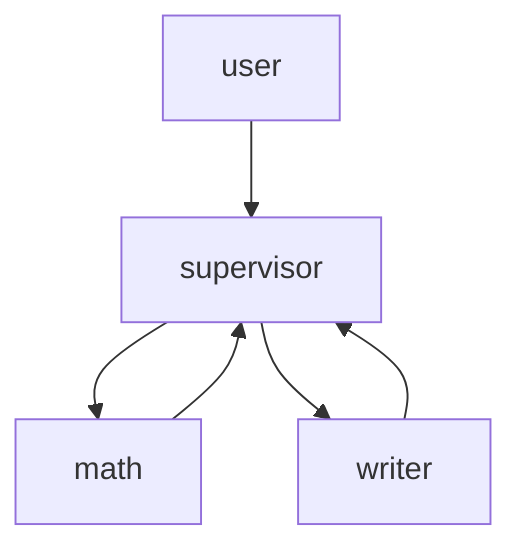

# 🤖 Your First Agent Team in 5 Minutes

Skip the boilerplate. Stop wrestling with TypeScript errors.
This starter kit gives you a **production-ready LangGraph setup** with:

✅ **Swarm pattern** – peer specialists that hand off control
✅ **Supervisor pattern** – a central manager that delegates tasks
✅ **Memory** – short-term (thread) + long-term (store)
✅ **Tools** – simple math + echo tools you can swap for your APIs
✅ **HTTP API** – ready to deploy as a microservice

---

## 🚀 Quick Start

```bash
git clone <this-repo>
cd agent-starter
npm install
cp .env.example .env # add your OPENAI_API_KEY
npm run dev # CLI demo
npm run dev:http # HTTP endpoints at http://localhost:3000
```

- POST `/swarm` → see peer agents hand off context
- POST `/supervisor` → see supervisor orchestrate specialists

---

## 🧩 Example Workflows

**Swarm**

- Alice (math expert)
- Bob (pirate who can multiply)
  Conversation flows automatically to the right agent.

**Supervisor**

- Supervisor decides: math problems → math agent, summarization → writer agent.
  Policy-driven orchestration out of the box.

---

## 🖼 Visual



---

## 🎯 Why This Matters

This kit is more than boilerplate. It’s a **launchpad**:

- Swap tools for Stripe/Firestore → investor dashboard agent
- Add web search → research assistant
- Add booking APIs → travel concierge

Your first AI agent team is running in 5 minutes.
The next billion-dollar startup may take a little longer 😉
